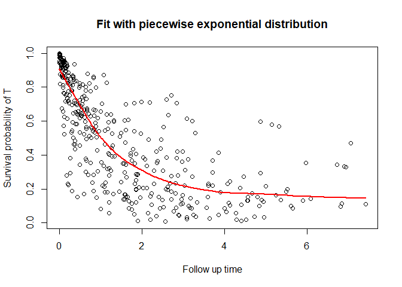

<!-- README.md is generated from README.Rmd. Please edit that file -->

# CureDepCens

<!-- badges: start -->
<!-- badges: end -->

Dependent censoring regression models with cure fraction for survival
multivariate data.

## Installation

You can install the development version of CureDepCens from
[GitHub](https://github.com/) with:

``` r
install.packages("devtools")
devtools::install_github("GabrielGrandemagne/CureDepCens")
```

## Example

This is a basic example which shows you how to solve a common problem:

``` r
#install.packages("devtools")
#devtools::install_github('GabrielGrandemagne/CureDepCens')
library(CureDepCens)

fit_mep <- cure_dep_censoring(formula = time ~ x1_cure + x_c2 | x_c1 + x_c2,
                           data = simula_fracur,
                           delta_t = simula_fracur$delta_t,
                           delta_c = simula_fracur$delta_c,
                           ident = simula_fracur$ident,
                           dist = "mep")
summary_cure(fit_mep)
#> 
#> MEP approach
#> 
#> Name  Estimate    Std. Error  CI INF      CI SUP      p-value     
#> Alpha    0.9494826   0.3350613   0.2927624   1.606203    8.862e-09   
#> Theta    0.7046463   0.2859001   0.144282    1.265011    
#> 
#> Coefficients Cure:
#> 
#> Name  Estimate    Std. Error  CI INF      CI SUP      p-value     
#> Interc   -0.7681673  0.175609    -1.112361   -0.4239737  1.891e-08   
#> x1_cur   0.2513102   0.1688953   -0.07972462 0.5823449   2.381e-06   
#> x_c2 0.1606192   0.1628136   -0.1584954  0.4797338   0.3017  
#> 
#> Coefficients C:
#> 
#> Name  Estimate    Std. Error  CI INF      CI SUP      p-value     
#> x_c1 0.1254494   0.1654851   -0.1989014  0.4498002   0.8414  
#> x_c2 -0.06702755 0.2152577   -0.4889327  0.3548776   4.008e-17   
#> 
#> ----------------------------------------------------------------------------------
#> 
#> Information criteria:
#> 
#> AIC   BIC      HQ    
#> 499.7818 563.6452 525.0726
```

*simula_fracur* is our simulated data frame. For more information check
the documentation for stored datasets.

``` r
head(simula_fracur)
#>           u         v         t        c      time event int x1_cure       x_c1
#> 1 0.5837057 0.4667029       Inf 3.157220 3.1572200     0   1       1  0.2389848
#> 2 0.8837577 0.8487360 0.5646770 1.858452 0.5646770     1   1       1  0.0300606
#> 3 0.5511697 0.4246619 0.4908744 2.008650 0.4908744     1   1       1 -0.7885869
#> 4 0.7350163 0.1795659 0.8468637 3.959086 0.2940002     0   1       0 -0.9316327
#> 5 0.2999046 0.5896202 2.3192531 1.588547 1.5885469     0   1       1 -0.5319098
#> 6 0.8517642 0.7052826 0.1572808 1.285308 0.1572808     1   1       1  1.4823647
#>   x_c2 cens ident delta_t delta_c
#> 1    1    2     1       0       1
#> 2    0    1     2       1       0
#> 3    1    1     3       1       0
#> 4    1    3     4       0       0
#> 5    0    2     5       0       1
#> 6    0    1     6       1       0
```

You can also plot the survival function

``` r
plot_cure(fit_mep, scenario = "t")
```


