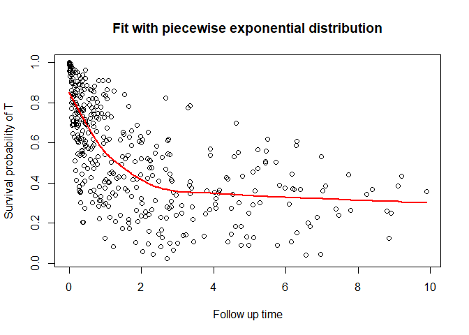

<!-- README.md is generated from README.Rmd. Please edit that file -->

# CureDepCens

<!-- badges: start -->
<!-- badges: end -->

Dependent censoring regression models with cure fraction for survival
multivariate data.

## Installation

You can install the development version of CureDepCens from
[GitHub](https://github.com/) with:

``` r
install.packages("devtools")
devtools::install_github("GabrielGrandemagne/CureDepCens")
```

## Example

This is a basic example which shows you how to solve a common problem:

``` r
install.packages("devtools")
#> Installing package into 'C:/Users/Gabriel-PC/AppData/Local/Temp/RtmpAB437N/temp_libpath1e1c51b67486'
#> (as 'lib' is unspecified)
#> package 'devtools' successfully unpacked and MD5 sums checked
#> 
#> The downloaded binary packages are in
#>  C:\Users\Gabriel-PC\AppData\Local\Temp\RtmpsHR7my\downloaded_packages
devtools::install_github('GabrielGrandemagne/CureDepCens')
#> Downloading GitHub repo GabrielGrandemagne/CureDepCens@HEAD
#> Formula (1.2-4 -> 1.2-5) [CRAN]
#> Installing 1 packages: Formula
#> Installing package into 'C:/Users/Gabriel-PC/AppData/Local/Temp/RtmpAB437N/temp_libpath1e1c51b67486'
#> (as 'lib' is unspecified)
#> package 'Formula' successfully unpacked and MD5 sums checked
#> 
#> The downloaded binary packages are in
#>  C:\Users\Gabriel-PC\AppData\Local\Temp\RtmpsHR7my\downloaded_packages
#> ── R CMD build ─────────────────────────────────────────────────────────────────
#>          checking for file 'C:\Users\Gabriel-PC\AppData\Local\Temp\RtmpsHR7my\remotes33e45fa668c\GabrielGrandemagne-CureDepCens-60ff8f6/DESCRIPTION' ...     checking for file 'C:\Users\Gabriel-PC\AppData\Local\Temp\RtmpsHR7my\remotes33e45fa668c\GabrielGrandemagne-CureDepCens-60ff8f6/DESCRIPTION' ...   ✔  checking for file 'C:\Users\Gabriel-PC\AppData\Local\Temp\RtmpsHR7my\remotes33e45fa668c\GabrielGrandemagne-CureDepCens-60ff8f6/DESCRIPTION'
#>       ─  preparing 'CureDepCens':
#>    checking DESCRIPTION meta-information ...     checking DESCRIPTION meta-information ...   ✔  checking DESCRIPTION meta-information
#>       ─  checking for LF line-endings in source and make files and shell scripts
#>       ─  checking for empty or unneeded directories
#>       ─  building 'CureDepCens_0.0.0.9000.tar.gz'
#>      
#> 
#> Installing package into 'C:/Users/Gabriel-PC/AppData/Local/Temp/RtmpAB437N/temp_libpath1e1c51b67486'
#> (as 'lib' is unspecified)
library(CureDepCens)

fit_mep <- cure_dep_censoring(formula = time ~ x1_cure + x_c2 | x_c1 + x_c2,
                           data = simula_fracur,
                           delta_t = simula_fracur$delta_t,
                           delta_c = simula_fracur$delta_c,
                           ident = simula_fracur$ident,
                           dist = "mep")
#> [1]  0.1374633 -0.2052321  0.3503769  0.1743567  0.1140473  0.1047635  0.8064467
#> [1]  0.3240155 -0.3242729  0.2630592  0.1954649  0.1069360  0.1549218  0.8958258
#> [1]  0.5102355 -0.4332569  0.2622140  0.1776157  0.1093429  0.1731880  0.9463454
#> [1]  0.6207088 -0.5115156  0.2754987  0.1743496  0.1109789  0.1203990  0.9174606
#> [1]  0.69076990 -0.59393707  0.26979426  0.19177159  0.10690692  0.07388395
#> [7]  0.86108293
#> [1]  0.77073132 -0.62367411  0.27200206  0.15520698  0.11264333  0.03743498
#> [7]  0.82707539
#> [1]  0.821138454 -0.689541988  0.255658700  0.157819359  0.117432241
#> [6]  0.004150374  0.802937095
#> [1]  0.83596124 -0.70873435  0.24239369  0.18223746  0.11971605 -0.02574332
#> [7]  0.78584060
#> [1]  0.83245903 -0.73037978  0.24936970  0.16583477  0.12145938 -0.04137133
#> [7]  0.84624908
#> [1]  0.82781193 -0.72583580  0.24182004  0.16377714  0.12186215 -0.04752882
#> [7]  0.90099867
#> [1]  0.85444610 -0.73422788  0.26443132  0.18069151  0.12458944 -0.04715885
#> [7]  0.82994073
#> [1]  0.8871980 -0.7087966  0.2592306  0.1685044  0.1152109 -0.0384455  0.7870347
#> [1]  0.88521455 -0.74554512  0.26730986  0.16285476  0.12734115 -0.04594038
#> [7]  0.79863148
#> [1]  0.93124682 -0.74267813  0.26507446  0.17168699  0.13270897 -0.03772476
#> [7]  0.72840299
#> [1]  0.93385958 -0.73471200  0.25749059  0.16873773  0.12334805 -0.04839158
#> [7]  0.70389128
#> [1]  0.94158514 -0.71999667  0.26405163  0.15967632  0.11526233 -0.04701807
#> [7]  0.68475149
#> [1]  0.96445556 -0.71315275  0.25555121  0.16056013  0.12703213 -0.05070292
#> [7]  0.66881922
#> [1]  0.99443029 -0.72212849  0.25033864  0.17434516  0.13499663 -0.05256133
#> [7]  0.67005706
#> [1]  0.99390557 -0.71708398  0.25222678  0.16586460  0.12758889 -0.05308592
#> [7]  0.64833196
#> [1]  0.96968970 -0.71472137  0.26245639  0.17330010  0.12277369 -0.05704495
#> [7]  0.65571319
#> [1]  0.97039209 -0.70490933  0.25930956  0.15444465  0.12862664 -0.06170014
#> [7]  0.68505313
#> [1]  0.97926752 -0.70871318  0.24464113  0.15875666  0.12847075 -0.06925094
#> [7]  0.66389150
#> [1]  0.99145204 -0.73096390  0.25392926  0.16917667  0.14291311 -0.06087012
#> [7]  0.68717273
#> [1]  0.98146411 -0.72609301  0.24244474  0.16519656  0.11931603 -0.06073307
#> [7]  0.69240573
#> [1]  0.9505033 -0.7667558  0.2492331  0.1797346  0.1306510 -0.0665267  0.7003730
#> [1]  0.96079695 -0.78076078  0.28672707  0.16310790  0.12258984 -0.06875664
#> [7]  0.67413764
#> [1]  0.9445825 -0.7656489  0.2537221  0.1634655  0.1203575 -0.0666735  0.7073056
#> [1]  0.95605276 -0.76525120  0.26811832  0.16886461  0.13046483 -0.05846199
#> [7]  0.70225927
#> [1]  0.95699178 -0.76108251  0.25973742  0.16688048  0.13014873 -0.05405629
#> [7]  0.70600113
#> [1]  0.93925150 -0.76432688  0.25248933  0.16688904  0.11672334 -0.05971207
#> [7]  0.71773935
#> [1]  0.95165738 -0.75299061  0.24331017  0.15770317  0.12097017 -0.06089624
#> [7]  0.71857826
#> [1]  0.93044740 -0.74929536  0.23683444  0.14957753  0.12637856 -0.06732699
#> [7]  0.75452514
#> [1]  0.92629670 -0.78269612  0.25723661  0.16989265  0.12268425 -0.05679963
#> [7]  0.76602159
#> [1]  0.9259506 -0.7596568  0.2387491  0.1576478  0.1304788 -0.0638187  0.7628020
#> [1]  0.93909579 -0.77691940  0.27579464  0.16637156  0.12871897 -0.06232586
#> [7]  0.69722066
#> [1]  0.95802483 -0.74730305  0.27611802  0.15333654  0.14136406 -0.06446201
#> [7]  0.68395785
#> [1]  0.96515039 -0.74395491  0.23542684  0.16895950  0.12088108 -0.05981315
#> [7]  0.69185841
#> [1]  0.93663596 -0.75776277  0.25265466  0.15971316  0.13576968 -0.06904474
#> [7]  0.71738557
#> [1]  0.91296088 -0.76942126  0.26498567  0.14993432  0.12154548 -0.07877499
#> [7]  0.71928971
#> [1]  0.90059081 -0.77715068  0.26239911  0.17228705  0.13175731 -0.06721887
#> [7]  0.73540563
#> [1]  0.90547119 -0.75779334  0.24797649  0.17250060  0.11577889 -0.05655788
#> [7]  0.73656249
#> [1]  0.90313469 -0.75946413  0.23987734  0.14350437  0.11899582 -0.07030439
#> [7]  0.75874133
#> [1]  0.89054602 -0.78800490  0.25008128  0.15579977  0.12234028 -0.06713199
#> [7]  0.75939070
#> [1]  0.9194662 -0.7761292  0.2515961  0.1614235  0.1274539 -0.0622317  0.7195483
#> [1]  0.94052988 -0.77601457  0.25377663  0.16471047  0.11951084 -0.05611072
#> [7]  0.70199004
#> [1]  0.9582782 -0.7620577  0.2475481  0.1569028  0.1257038 -0.0641426  0.7218014
#> [1]  0.93849525 -0.77520412  0.25983142  0.17013491  0.11970016 -0.05554026
#> [7]  0.72310948
#> [1]  0.93037614 -0.76347832  0.27863120  0.14727970  0.12867585 -0.06583184
#> [7]  0.73336591
#> [1]  0.93220560 -0.78007932  0.26052384  0.15658580  0.11826796 -0.06471042
#> [7]  0.74966039
#> [1]  0.91394333 -0.76976551  0.25264553  0.17177473  0.12160609 -0.05787572
#> [7]  0.73483082
#> [1]  0.91485550 -0.77593248  0.26476955  0.16130156  0.11983563 -0.06286815
#> [7]  0.74414275
#> [1]  0.9320593 -0.7746353  0.2572918  0.1618041  0.1239305 -0.0631430  0.7217376
#> [1]  0.92750581 -0.77077209  0.25313912  0.16727085  0.12314749 -0.06286847
#> [7]  0.71145117
#> [1]  0.92155708 -0.77494563  0.25356741  0.16351461  0.12493569 -0.06597325
#> [7]  0.71468952
#> [1]  0.9107944 -0.7869516  0.2523874  0.1674763  0.1223834 -0.0631572  0.7407550
#> [1]  0.9252225 -0.7806004  0.2486849  0.1580802  0.1184483 -0.0570167  0.7192518
#> [1]  0.93412784 -0.77928524  0.25365923  0.16292084  0.12223970 -0.05861978
#> [7]  0.72403114
#> [1]  0.93907955 -0.78440670  0.26171141  0.16580066  0.12857647 -0.05768783
#> [7]  0.70407787
#> [1]  0.9415424 -0.7728850  0.2611697  0.1615135  0.1210878 -0.0603243  0.7009201
#> [1]  0.95878545 -0.77725636  0.25684095  0.16766588  0.12055587 -0.05847531
#> [7]  0.68981813
#> [1]  0.9429968 -0.7740344  0.2509379  0.1574650  0.1170933 -0.0621732  0.7012474
#> [1]  0.95074694 -0.77603825  0.25867418  0.16357201  0.12183976 -0.06228531
#> [7]  0.70363364
#> [1]  0.94723538 -0.77831900  0.24624653  0.16222448  0.13604568 -0.06657801
#> [7]  0.71140993
#> [1]  0.95182650 -0.78435858  0.25812290  0.17153018  0.12245681 -0.06256801
#> [7]  0.69475951
#> [1]  0.94965101 -0.77831689  0.25657282  0.16001189  0.13095903 -0.06794089
#> [7]  0.70997697
#> [1]  0.9615074 -0.7858869  0.2654449  0.1571093  0.1268283 -0.0677096  0.7049853
#> [1]  0.9632402 -0.7769386  0.2526657  0.1638472  0.1220127 -0.0600507  0.6872395
#> [1]  0.95934356 -0.78647031  0.26280106  0.17077224  0.12371647 -0.06001265
#> [7]  0.67700648
#> [1]  0.94317189 -0.79163826  0.25241647  0.16976631  0.13277905 -0.06328756
#> [7]  0.70677318
#> [1]  0.94815345 -0.79092474  0.25104328  0.15762321  0.12656698 -0.06759498
#> [7]  0.69982018
#> [1]  0.94037236 -0.77665376  0.24393253  0.16790793  0.12386752 -0.06559636
#> [7]  0.71517618
#> [1]  0.94007046 -0.77068643  0.25168795  0.16412546  0.12085920 -0.05783021
#> [7]  0.70445675
#> [1]  0.93590376 -0.76884647  0.25323639  0.16334255  0.12797899 -0.06361075
#> [7]  0.72473611
#> [1]  0.93088799 -0.77692052  0.26154793  0.16429100  0.12633765 -0.06717639
#> [7]  0.70697027
#> [1]  0.94770981 -0.77938733  0.26699688  0.15951818  0.12777108 -0.06056541
#> [7]  0.69007064
#> [1]  0.94167924 -0.77796268  0.26008681  0.16124241  0.12768857 -0.07101483
#> [7]  0.69135850
#> [1]  0.94891853 -0.76816181  0.25241653  0.16311666  0.13434477 -0.06720434
#> [7]  0.68487716
#> [1]  0.95076467 -0.77887553  0.24856274  0.15800881  0.12850280 -0.06342319
#> [7]  0.68420601
#> [1]  0.95264792 -0.79240159  0.25463838  0.16632040  0.12645058 -0.06461222
#> [7]  0.68844496
#> [1]  0.94803926 -0.79227045  0.24552961  0.16113056  0.13047750 -0.06241866
#> [7]  0.71085985
#> [1]  0.93715801 -0.79261670  0.26057333  0.16431237  0.12890206 -0.06143164
#> [7]  0.71180503
#> [1]  0.94748572 -0.78787369  0.25095976  0.16680078  0.12526424 -0.06113666
#> [7]  0.70765324
#> [1]  0.93822167 -0.78512496  0.26310558  0.16187098  0.12847973 -0.06167591
#> [7]  0.72734010
#> [1]  0.93957065 -0.78152828  0.25808805  0.17146640  0.12172140 -0.06022576
#> [7]  0.72573448
#> [1]  0.92856394 -0.76860349  0.25512104  0.15738052  0.12918347 -0.06493096
#> [7]  0.73041661
#> [1]  0.93119883 -0.76568799  0.24958017  0.16443129  0.12581216 -0.06572382
#> [7]  0.72669121
#> [1]  0.93549677 -0.77863010  0.25570817  0.16624546  0.12833061 -0.06624427
#> [7]  0.72255709
#> [1]  0.94192770 -0.77087229  0.25748437  0.15460811  0.12647847 -0.06801137
#> [7]  0.73008288
#> [1]  0.94188623 -0.77067664  0.25309422  0.15759841  0.12575306 -0.06806332
#> [7]  0.71568441
#> [1]  0.93892882 -0.76812073  0.23607667  0.16230444  0.11931171 -0.06685716
#> [7]  0.71914180
#> [1]  0.94007561 -0.77793117  0.25240156  0.15305738  0.12342409 -0.06821406
#> [7]  0.72074962
#> [1]  0.95265292 -0.76297696  0.24909275  0.15699061  0.12510607 -0.06808619
#> [7]  0.70779718
#> [1]  0.94382895 -0.77756964  0.26891153  0.16412600  0.12808343 -0.06510119
#> [7]  0.69721142
#> [1]  0.95013185 -0.76342249  0.25548318  0.16838381  0.13124007 -0.06417838
#> [7]  0.70321291
#> [1]  0.95464533 -0.77232197  0.25602306  0.16363855  0.12626228 -0.06309391
#> [7]  0.70046364
#> [1]  0.94910107 -0.78603363  0.25810565  0.15965300  0.13017034 -0.06436105
#> [7]  0.71843280
#> [1]  0.9416513 -0.7998642  0.2600272  0.1649335  0.1306064 -0.0649963  0.7294582
#> [1]  0.95015287 -0.79660541  0.26311516  0.16513002  0.12812848 -0.05609809
#> [7]  0.72492296
#> [1]  0.93997947 -0.78867726  0.24404975  0.17148745  0.13004883 -0.05506963
#> [7]  0.73063458
#> [1]  0.94277001 -0.79074419  0.25895986  0.16496626  0.12841230 -0.05952373
#> [7]  0.70454606
#> [1]  0.94286537 -0.79190890  0.25440231  0.16136070  0.12350286 -0.06478256
#> [7]  0.71458421
#> [1]  0.94606619 -0.79707290  0.25984738  0.15863625  0.12743694 -0.06463314
#> [7]  0.71676170
#> [1]  0.93402255 -0.79287676  0.26624927  0.16616769  0.12761910 -0.06685741
#> [7]  0.70851769
#> [1]  0.93808253 -0.78120525  0.25309943  0.16431301  0.12219185 -0.06091184
#> [7]  0.70462320
#> [1]  0.93890321 -0.78244900  0.24553252  0.16430436  0.12122132 -0.05895632
#> [7]  0.72191861
#> [1]  0.93918546 -0.79251906  0.26330428  0.17028923  0.12067102 -0.05997103
#> [7]  0.70421818
#> [1]  0.94123966 -0.79177740  0.25846159  0.15989085  0.12077853 -0.05887451
#> [7]  0.69601524
#> [1]  0.94987290 -0.79847660  0.25769908  0.16924169  0.12516546 -0.05749463
#> [7]  0.69400112
#> [1]  0.93849366 -0.79811495  0.26491730  0.15653555  0.12535375 -0.06193988
#> [7]  0.72213406
#> [1]  0.93383925 -0.79483188  0.26249595  0.15992421  0.12397930 -0.06766196
#> [7]  0.71029931
#> [1]  0.96313995 -0.79503423  0.25970000  0.16503368  0.12951233 -0.06032526
#> [7]  0.69445154
#> [1]  0.95708277 -0.78530351  0.25384106  0.15891728  0.12702454 -0.06611621
#> [7]  0.68981550
#> [1]  0.95354805 -0.77932911  0.25276820  0.15936794  0.13128195 -0.07075314
#> [7]  0.69389532
#> [1]  0.95488357 -0.78013384  0.26078970  0.15889461  0.13006436 -0.07052389
#> [7]  0.69821857
#> [1]  0.95567517 -0.78432111  0.26290562  0.16193919  0.12972254 -0.07107644
#> [7]  0.69942425
#> [1]  0.95847549 -0.79378935  0.26097270  0.16172805  0.12698235 -0.06832927
#> [7]  0.69300766
#> [1]  0.95463703 -0.78683392  0.25275838  0.16465202  0.12818221 -0.06612026
#> [7]  0.70677197
#> [1]  0.9475515 -0.7923441  0.2556358  0.1607990  0.1252606 -0.0684038  0.7098150
#> [1]  0.94839391 -0.78294167  0.25819686  0.16379824  0.12490857 -0.06712093
#> [7]  0.70529448
#> [1]  0.9522449 -0.7789067  0.2641602  0.1640713  0.1308640 -0.0665379  0.6865526
#> [1]  0.95433491 -0.77561221  0.25326891  0.15988933  0.12521642 -0.06615667
#> [7]  0.70250044
#> [1]  0.94281801 -0.77659529  0.25097642  0.16400050  0.12738464 -0.06711401
#> [7]  0.71358121
#> [1]  0.9444636 -0.7787941  0.2577078  0.1614926  0.1265204 -0.0687912  0.7186574
#> [1]  0.94044075 -0.77355166  0.26194862  0.16811585  0.12063252 -0.06361371
#> [7]  0.71495983
#> [1]  0.93943592 -0.77212519  0.25729241  0.15318722  0.12340627 -0.07038263
#> [7]  0.72326311
#> [1]  0.94030929 -0.78071108  0.25115970  0.15956188  0.12643090 -0.06897116
#> [7]  0.72289619
#> [1]  0.95302853 -0.77934358  0.25652774  0.16795599  0.12040180 -0.05770022
#> [7]  0.70738690
#> [1]  0.94054099 -0.77744375  0.25490301  0.16664526  0.12976062 -0.06791568
#> [7]  0.70789166
#> [1]  0.9452040 -0.7705590  0.2597849  0.1611826  0.1228645 -0.0681198  0.7105374
#> [1]  0.94545846 -0.76514008  0.25197036  0.16228173  0.11903441 -0.06261747
#> [7]  0.72124786
#> [1]  0.93384646 -0.75744828  0.24721892  0.15737206  0.12617932 -0.07009255
#> [7]  0.73001477
#> [1]  0.94175666 -0.77238347  0.25489041  0.16556416  0.12796912 -0.06649387
#> [7]  0.72055022
#> [1]  0.9402211 -0.7676393  0.2469157  0.1656902  0.1208618 -0.0611662  0.7291068
#> [1]  0.92923798 -0.76990416  0.25448194  0.16504074  0.12164087 -0.06132974
#> [7]  0.73239852
#> [1]  0.93961107 -0.75900099  0.25660753  0.15750527  0.12312702 -0.05830901
#> [7]  0.72324179
#> [1]  0.93092349 -0.76541293  0.25243403  0.17106705  0.12504853 -0.05738939
#> [7]  0.74392307
#> [1]  0.94021343 -0.75849989  0.24944918  0.16353051  0.12505793 -0.05718994
#> [7]  0.72910577
#> [1]  0.94241017 -0.76629318  0.24740614  0.16170966  0.12265922 -0.05974848
#> [7]  0.72136840
#> [1]  0.94433365 -0.76944850  0.24826242  0.16137406  0.12213680 -0.06259267
#> [7]  0.72874291
#> [1]  0.93312437 -0.76888844  0.25201591  0.15917783  0.12596674 -0.06605338
#> [7]  0.73483680
#> [1]  0.92914940 -0.77860851  0.26060901  0.16773973  0.12357882 -0.06211744
#> [7]  0.71844819
#> [1]  0.92846191 -0.78611510  0.25675492  0.16650187  0.12302074 -0.05913417
#> [7]  0.72495227
#> [1]  0.93190335 -0.77111140  0.25385980  0.16307935  0.12985918 -0.06175471
#> [7]  0.73464354
#> [1]  0.93108942 -0.77116073  0.25425154  0.16485962  0.12619639 -0.06475196
#> [7]  0.73011403
#> [1]  0.94797087 -0.75331951  0.24813052  0.16147000  0.12069750 -0.06049508
#> [7]  0.71272688
#> [1]  0.94564042 -0.76709017  0.25675560  0.16301457  0.12440664 -0.05949046
#> [7]  0.70405821
#> [1]  0.95480592 -0.76679702  0.25513207  0.16067861  0.12631310 -0.06131971
#> [7]  0.69632611
#> [1]  0.94685419 -0.76507029  0.25812645  0.15437872  0.12725797 -0.06441226
#> [7]  0.70761595
#> [1]  0.95240666 -0.77419053  0.26178198  0.16852418  0.12540835 -0.05623984
#> [7]  0.69217399
#> [1]  0.94624769 -0.78487981  0.25667518  0.16620248  0.12489042 -0.05633595
#> [7]  0.71574093
#> [1]  0.94213232 -0.77892567  0.25819397  0.16814860  0.12171435 -0.05860037
#> [7]  0.70820362
#> [1]  0.94574012 -0.76687946  0.25839729  0.16559236  0.12702041 -0.06014008
#> [7]  0.71062156
#> [1]  0.95283300 -0.76392023  0.24961908  0.16786372  0.12483938 -0.05803827
#> [7]  0.69744385
#> [1]  0.95918188 -0.77755826  0.26161029  0.16803810  0.12535656 -0.05691695
#> [7]  0.68699181
#> [1]  0.97168372 -0.77257457  0.26430561  0.16042355  0.12941770 -0.05741601
#> [7]  0.68086287
#> [1]  0.96677922 -0.77267807  0.26101803  0.16161253  0.12573315 -0.05982593
#> [7]  0.68380715
#> [1]  0.96397108 -0.77424549  0.25827347  0.16221093  0.12622996 -0.06853337
#> [7]  0.68621062
#> [1]  0.95018201 -0.78071307  0.25624282  0.15807820  0.12460467 -0.07013354
#> [7]  0.70942099
#> [1]  0.94598321 -0.77012951  0.24922257  0.16358101  0.12320819 -0.06748018
#> [7]  0.70891729
#> [1]  0.95536438 -0.77517479  0.25188305  0.16600632  0.12816955 -0.06520696
#> [7]  0.69843808
#> [1]  0.96022429 -0.76746333  0.25185097  0.15711319  0.12585183 -0.06652827
#> [7]  0.69565939
#> [1]  0.95844766 -0.77855623  0.25636584  0.16164051  0.12850353 -0.06598318
#> [7]  0.68700159
#> [1]  0.95142287 -0.78168038  0.26178636  0.16436470  0.12529189 -0.06262989
#> [7]  0.69509715
#> [1]  0.95603903 -0.77904042  0.25299199  0.16337183  0.12569869 -0.06248615
#> [7]  0.70914061
#> [1]  0.95705644 -0.76226103  0.24091443  0.15914579  0.12044286 -0.06235853
#> [7]  0.69651018
#> [1]  0.94238902 -0.76590981  0.25043712  0.16553273  0.12995040 -0.06481634
#> [7]  0.70664097
#> [1]  0.93700863 -0.76207235  0.24555236  0.16146730  0.12316133 -0.06505789
#> [7]  0.71648039
#> [1]  0.94340949 -0.76914779  0.25375647  0.16192771  0.12486435 -0.05947024
#> [7]  0.70106054
#> [1]  0.93898487 -0.76682159  0.25569925  0.16661408  0.12476990 -0.05822202
#> [7]  0.70237942
#> [1]  0.93494267 -0.76819969  0.25671596  0.16179914  0.12277029 -0.06091993
#> [7]  0.72092955
#> [1]  0.93456353 -0.77546516  0.25411161  0.16756510  0.12783755 -0.05804365
#> [7]  0.73065502
#> [1]  0.92966643 -0.77426516  0.25603858  0.16379349  0.12559100 -0.06312923
#> [7]  0.72897048
#> [1]  0.93031232 -0.76730470  0.24369335  0.16540112  0.12720390 -0.06165341
#> [7]  0.74273948
#> [1]  0.93910855 -0.77189761  0.25336304  0.16424039  0.12943007 -0.06346275
#> [7]  0.72941891
#> [1]  0.9362131 -0.7786654  0.2578991  0.1677192  0.1278222 -0.0615991  0.7264076
#> [1]  0.93535603 -0.76655367  0.25654472  0.15866554  0.12659904 -0.06377597
#> [7]  0.72031699
#> [1]  0.94177835 -0.76611009  0.25236616  0.15716368  0.12667226 -0.06755224
#> [7]  0.72566076
#> [1]  0.94641955 -0.77208509  0.25305547  0.16514781  0.12112565 -0.06167517
#> [7]  0.70304998
#> [1]  0.93826750 -0.76788254  0.26669910  0.15640042  0.12514651 -0.06616557
#> [7]  0.71021095
#> [1]  0.94749972 -0.76637999  0.25872355  0.16226848  0.12534036 -0.06324624
#> [7]  0.70037005
#> [1]  0.94651618 -0.76993824  0.25618375  0.16560916  0.12424806 -0.06172585
#> [7]  0.69837778
#> [1]  0.95987671 -0.76707108  0.25672354  0.15828388  0.12566970 -0.06401129
#> [7]  0.69082802
#> [1]  0.95740064 -0.76677751  0.25263656  0.16547904  0.12784081 -0.06588767
#> [7]  0.69093484
#> [1]  0.94441520 -0.77107376  0.25440494  0.16554953  0.12526429 -0.06344553
#> [7]  0.69937525
#> [1]  0.94201763 -0.77131141  0.26549110  0.16636416  0.12311080 -0.06036612
#> [7]  0.70065370
#> [1]  0.94833469 -0.75916928  0.25642855  0.15978224  0.12657577 -0.06262812
#> [7]  0.70456308
#> [1]  0.93734366 -0.76236942  0.25760709  0.15725006  0.12953381 -0.07056454
#> [7]  0.71800755
#> [1]  0.94698046 -0.76379655  0.25307347  0.16436535  0.12706474 -0.06619485
#> [7]  0.71566635
#> [1]  0.93862091 -0.77521271  0.25644917  0.16469991  0.12767492 -0.06440998
#> [7]  0.72027200
#> [1]  0.93774178 -0.76564315  0.25012715  0.16244176  0.12556249 -0.06655324
#> [7]  0.71734126
#> [1]  0.93488559 -0.76245973  0.25516084  0.16448837  0.12399445 -0.06582551
#> [7]  0.70474562
#> [1]  0.93810340 -0.77192833  0.26087401  0.16398614  0.12515348 -0.06167735
#> [7]  0.70112937
#> [1]  0.94617747 -0.77630578  0.26113819  0.17058041  0.12307602 -0.05686743
#> [7]  0.68748607
#> [1]  0.95210229 -0.77102694  0.25361850  0.15911877  0.12459810 -0.06189549
#> [7]  0.69900483
#> [1]  0.95277878 -0.76805828  0.25605807  0.16582925  0.12515653 -0.06078001
#> [7]  0.68606759
#> [1]  0.95477161 -0.77016866  0.26143530  0.16733114  0.12705259 -0.06160506
#> [7]  0.68877747
#> [1]  0.94640156 -0.77693487  0.25772894  0.16588128  0.12743044 -0.06278972
#> [7]  0.69627178
#> [1]  0.95138852 -0.76839045  0.25566088  0.16220067  0.12716859 -0.06557096
#> [7]  0.69575463
#> [1]  0.94613832 -0.76994913  0.25625009  0.16277356  0.12387970 -0.06668431
#> [7]  0.70101691
#> [1]  0.94408117 -0.77074187  0.26024096  0.16204519  0.12294090 -0.06753086
#> [7]  0.70290155
summary_cure(fit_mep)
#> 
#> MEP approach
#> 
#> Name  Estimate    Std. Error  CI INF      CI SUP      p-value     
#> Alpha    0.9472027   0.3341324   0.2923032   1.602102    1.195e-08   
#> Theta    0.699891    0.2861083   0.1391188   1.260663    
#> 
#> Coefficients Cure:
#> 
#> Name  Estimate    Std. Error  CI INF      CI SUP      p-value     
#> Interc   -0.7696938  0.5313027   -1.811047   0.2716595   1.715e-08   
#> x1_cur   0.257384    0.1679863   -0.07186914 0.5866371   2.383e-06   
#> x_c2 0.1623398   0.163145    -0.1574244  0.482104    0.2903  
#> 
#> Coefficients C:
#> 
#> Name  Estimate    Std. Error  CI INF      CI SUP      p-value     
#> x_c1 0.1246631   0.1656776   -0.2000651  0.4493912   0.842   
#> x_c2 -0.06659538 0.214303    -0.4866293  0.3534385   1.343e-16   
#> 
#> ----------------------------------------------------------------------------------
#> 
#> Information criteria:
#> 
#> AIC   BIC      HQ    
#> 499.2609 563.1244 524.5517
```

*simula_fracur* is our simulated data frame. For more information check
the documentation for stored datasets.

``` r
head(simula_fracur)
#>           u         v         t        c      time event int x1_cure       x_c1
#> 1 0.5837057 0.4667029       Inf 3.157220 3.1572200     0   1       1  0.2389848
#> 2 0.8837577 0.8487360 0.5646770 1.858452 0.5646770     1   1       1  0.0300606
#> 3 0.5511697 0.4246619 0.4908744 2.008650 0.4908744     1   1       1 -0.7885869
#> 4 0.7350163 0.1795659 0.8468637 3.959086 0.2940002     0   1       0 -0.9316327
#> 5 0.2999046 0.5896202 2.3192531 1.588547 1.5885469     0   1       1 -0.5319098
#> 6 0.8517642 0.7052826 0.1572808 1.285308 0.1572808     1   1       1  1.4823647
#>   x_c2 cens ident delta_t delta_c
#> 1    1    2     1       0       1
#> 2    0    1     2       1       0
#> 3    1    1     3       1       0
#> 4    1    3     4       0       0
#> 5    0    2     5       0       1
#> 6    0    1     6       1       0
```

You can also plot the survival function

``` r
plot_cure(fit_mep, scenario = "t")
```


